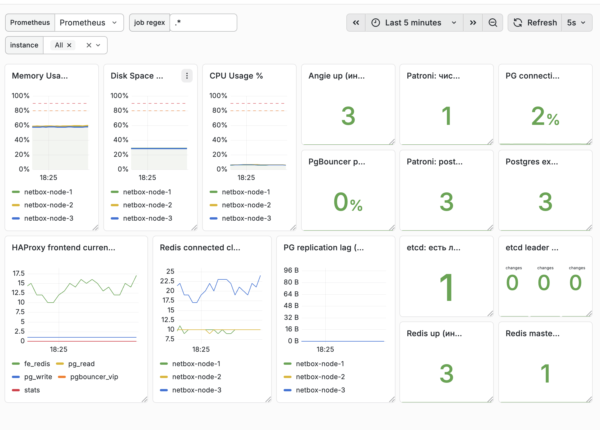

# HA NetBox для сетевой инфраструктуры

**NetBox без SPOF (Single Point Of Failure)
классическая HA архитектура**

Сергей Савелов
LiveOps / Infrastructure

---

# Почему вообще об этом говорить

NetBox часто становится:

- Source of Truth
- IPAM
- база для автоматизации
- зависимость для CI/CD

Если NetBox падает:

- нельзя выделять IP
- автоматизация ломается
- часть процессов возвращается в Excel

---

# Типичная установка NetBox

Обычно всё выглядит так:

NetBox
PostgreSQL
Redis

Часто это **одна VM или сервер**.
Это означает один SPOF.

---

# Что происходит при проблемах

Типичные события:

- перезагрузка сервера
- обновление системы
- обслуживание гипервизора
- отказ диска
- падение VM

В этот момент **NetBox полностью недоступен**.

> часть инфраструктуры перестаёт работать.

---

# Требование бизнеса

NetBox — control plane инфраструктуры

Если он недоступен:
- ломается автоматизация
- CI/CD теряет доступ к данным

> NetBox должен переживать типовые отказы без остановки сервиса

---

# Разбираем NetBox

NetBox состоит из:

- Web UI
- background workers
- PostgreSQL
- Redis

Поэтому отказоустойчивость нужно обеспечить на нескольких уровнях.

---

# Возможные подходы

1. Kubernetes — сложность
2. Managed сервисы — не всегда доступны
3. Классический HA — простой и понятный

Мы выбрали **классический HA**.

---

# Основная идея

Что нужно обеспечить:

- несколько NetBox
- HA для базы
- HA для Redis
- единая точка доступа

---

# Архитектура решения

---

# Основные компоненты

**PostgreSQL**
_→ Patroni_

**Redis**
_→ replication / sentinel_

**Балансировка**
_→ HAProxy + Keepalived_

**NetBox**
_→ несколько инстансов_

**Connection pooling**
_→ PgBouncer_

---

# Что происходит при падении

**NetBox**
_Если падает активная нода NetBox — VIP просто переезжает._

**PostgreSQL**
_Если падает leader — Patroni выбирает нового, HAProxy начинает слать трафик туда._

**Redis**
_Redis переключается на master через health checks._

**Нода целиком**
_Если падает вся VM — VIP переезжает, сервис продолжает работать._

---

# NetBox

1. На активной ноде падает Angie или NetBox
1. Keepalived снижает приоритет
1. VIP переезжает

---

# PostgreSQL

1. отключаем одну ноду PostgreSQL
1. Patroni выбирает нового лидера
1. HAProxy начинает слать трафик туда

---

# Redis

1. Падает Redis master  
1. Sentinel обнаруживает сбой  
1. Выбирается новый master  
1. HAProxy начинает слать трафик на него  

---

# Инфраструктура

1. Падает целая VM / сервер  
2. Keepalived теряет heartbeat  
3. VIP переносится на другую ноду  
4. Сервисы продолжают работать   

---

# Что важно в эксплуатации

Нужно мониторить:

- доступность NetBox
- статус лидера PostgreSQL
- состояние Redis
- backup
- процедуры восстановления

Также важно иметь:

- схему архитектуры
- инструкции восстановления 

---

# Итоги

NetBox — критическая система инфраструктуры.

HA:

- уменьшает риск недоступности
- делает систему сложнее
- требует понимания архитектуры

Но для production это оправдано.

---

# Спасибо

Вопросы?
